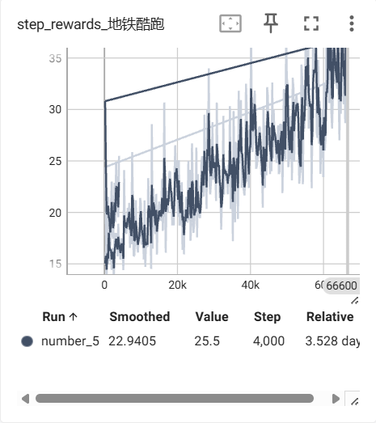
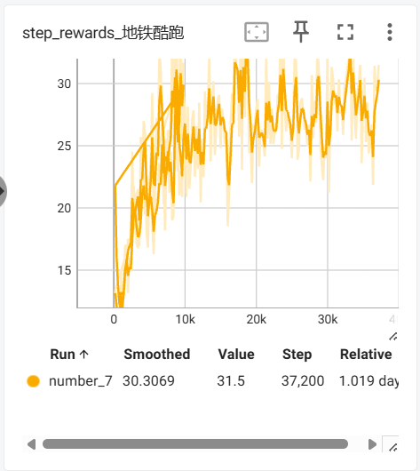

# PPO的应用案例

## 介绍
* 这里将该算法应用到安卓模拟器中，并且可以自主设计特征参数空间以及调参， 这里没有使用gym等库和工具，而是在模拟在实际应用的一些场景，这里允许你设计自己的代码，和对数据随意的处理（不免会遇到有趣的问题），通过scrcpy，实现对游戏的控制，自主玩游戏——地铁酷跑， 可以自主的进步和优化。
* 这将是一个很好的**项目结构**来进行迁移到其他几乎任何游戏（不过需要自己写一些结束条件，和激励策略）。
* 我使用了(https://github.com/nikhilbarhate99/PPO-PyTorch)大佬的项目， 并改动了里面必要的结构，使用起来会更方便。
* 本人在做的过程中，明白了很多参数的直观含义和理解，都在注释中有对应的体现， 希望能帮到您。
* 写码不易， 点个星支持一下！

## 环境要求

* [PyTorch](http://pytorch.org/)
* [地铁跑酷](https://www.modelscope.cn/datasets/Hook51/subWaySurf/files) 
* [Google Tesseract](https://github.com/tesseract-ocr/tesseract)——参考（http://t.csdnimg.cn/UaFcy）
* [蓝叠安卓模拟器](https://www.bluestacks.cn/)
* [adb](https://dl.google.com/android/repository/platform-tools-latest-windows.zip) ——参考(http://t.csdnimg.cn/TWIOO)
```bash
# 其他python库，可以直接安装
pip install -r requirements.txt
```
## 用法
* **config.py**:里面包含了整个项目的重要参数， 里面有详细的注释，一定将里面的参数设置成自己的配置，再去测试和训练模型。
* **main.py**:配置改好后，点开模拟器，即可开始运行。
* **train.py**: 里面是PPO算法在训练过程中的总逻辑。
* **predict.py**: 可以运行这个看最终模型的效果。
* **test***.**py**:里面是对一些功能的测试，可以不用管，也可以直接使用。
* **Myclass.py**: 一些封装好的功能。
* **AndroidController.py**: 负责检测模拟器的连接和游戏启动。
## 注意
* 请务必安装好相应的工具。
* 本项目主要目的是为了娱乐学习， 如果有更好的优化策略，或者其他问题，希望可以留言共享。

## 结果



## 推理测试


